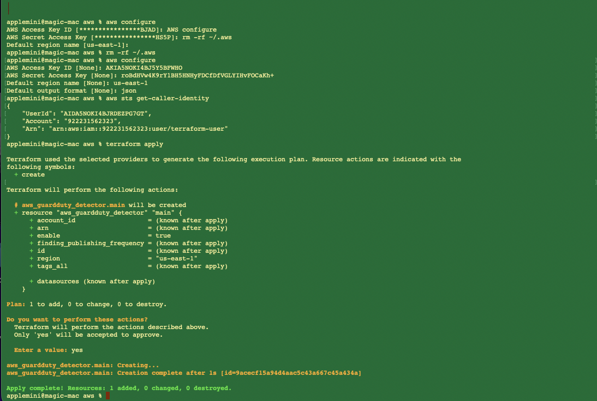
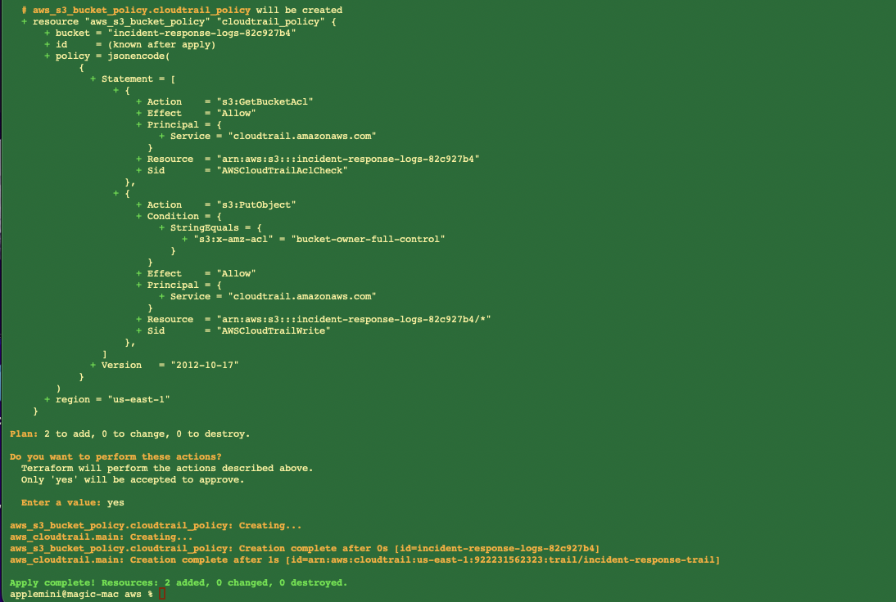
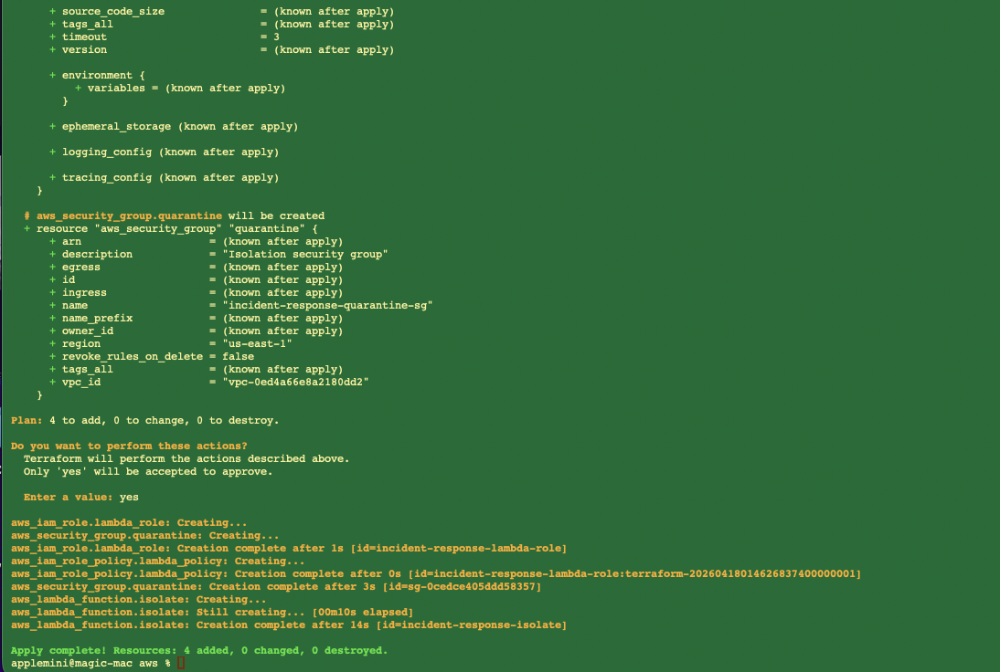
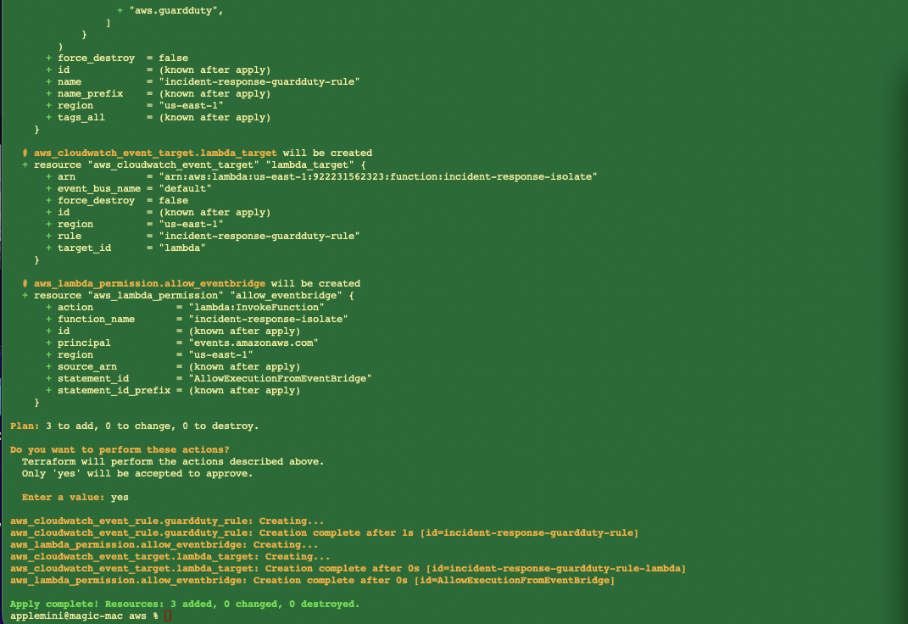
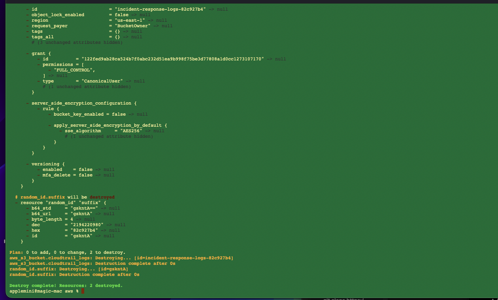

# Multi-Cloud Incident Response Automation

Automated incident response platform built with Infrastructure as Code (Terraform), cloud-native security services, and event-driven automation.

The goal of this project is to demonstrate how security findings can automatically trigger containment actions across cloud environments, reducing response times and improving operational efficiency.

---

## Project Objectives

* Automate security incident response workflows
* Reduce manual containment effort
* Demonstrate cloud-native security automation
* Implement Infrastructure as Code (IaC)
* Build reusable multi-cloud security patterns
* Integrate threat detection with automated remediation

---

## Current Implementation Status

| Platform                  | Status   |
| ------------------------- | -------- |
| AWS                       | Complete |
| Azure                     | Planned  |
| Multi-Cloud Orchestration | Planned  |

---

# AWS Incident Response Automation

## Solution Overview

The AWS implementation automatically isolates potentially compromised EC2 instances when Amazon GuardDuty generates a security finding.

The workflow integrates threat detection, event processing, automated remediation, logging, and auditing into a single automated response pipeline.

---

## AWS Architecture

```text
                    +------------------+
                    | Amazon GuardDuty |
                    +---------+--------+
                              |
                              v
                    +------------------+
                    | Amazon EventBridge|
                    +---------+--------+
                              |
                              v
                    +------------------+
                    | AWS Lambda       |
                    | Isolation Engine |
                    +---------+--------+
                              |
                              v
                    +------------------+
                    | EC2 Instance     |
                    | Quarantine SG    |
                    +------------------+

Supporting Services
-------------------
• AWS IAM
• AWS CloudTrail
• Amazon S3
```

---

## AWS Security Workflow

1. Amazon GuardDuty detects suspicious activity.
2. GuardDuty generates a security finding.
3. Amazon EventBridge receives the event.
4. AWS Lambda is automatically invoked.
5. Lambda identifies the affected EC2 instance.
6. A quarantine security group is applied.
7. CloudTrail records all response activity.
8. Logs are retained in Amazon S3.

---

## Technologies Used

### Security Services

* Amazon GuardDuty
* AWS CloudTrail
* AWS IAM

### Automation Services

* AWS Lambda
* Amazon EventBridge

### Infrastructure

* Terraform
* Amazon S3
* Amazon EC2

---

## AWS Components Deployed

### Detection

* GuardDuty Detector

### Logging

* CloudTrail Trail
* S3 Log Storage Bucket

### Automation

* Lambda Function
* IAM Role
* IAM Policies

### Event Processing

* EventBridge Rule
* EventBridge Target
* Lambda Invocation Permissions

### Containment

* Quarantine Security Group

---

## Lambda Containment Logic

```python
ec2.modify_instance_attribute(
    InstanceId=instance_id,
    Groups=[QUARANTINE_SG]
)
```

This action removes existing security groups and applies a quarantine security group to isolate the affected EC2 instance.

---

## Project Screenshots

### GuardDuty Deployment



### CloudTrail Deployment



### Lambda Deployment



### EventBridge Integration



### Resource Cleanup



---

## Skills Demonstrated

### Cloud Security

* Threat Detection
* Security Monitoring
* Incident Response
* Security Operations

### Cloud Engineering

* Terraform
* Infrastructure as Code
* AWS Architecture
* IAM Design

### Automation

* Event-Driven Architecture
* Serverless Automation
* Automated Remediation
* Security Workflow Automation

---

## Project Outcomes

Successfully deployed and validated an automated AWS incident response workflow using Terraform and AWS security services.

This implementation demonstrates:

* Automated threat response
* Cloud-native security operations
* Security service integration
* Infrastructure as Code deployment
* Automated containment workflows

---

# Azure Incident Response Automation

**Status: Planned**

The Azure implementation will extend the same incident response concepts using Azure-native security services.

### Planned Services

* Microsoft Defender for Cloud
* Microsoft Sentinel
* Azure Functions
* Azure Monitor
* Log Analytics Workspace
* Azure Event Grid
* Azure Storage Account

### Planned Workflow

```text
Microsoft Defender for Cloud
            ↓
      Azure Monitor
            ↓
      Event Grid
            ↓
     Azure Function
            ↓
 Automated Containment
```

Future updates will include architecture diagrams, deployment screenshots, Terraform code, and validation testing.

---

# Future Enhancements

## AWS

* AWS Security Hub Integration
* SNS Notifications
* Slack Integration
* Advanced Event Filtering

## Azure

* Microsoft Sentinel Playbooks
* Logic Apps Automation
* Automated VM Isolation
* Defender for Cloud Integration

## Multi-Cloud

* Unified Security Dashboard
* Cross-Cloud Incident Correlation
* Centralized Alerting
* Automated Multi-Cloud Remediation

---

## Repository Structure

```text
multi-cloud-incident-response-automation/
│
├── aws/
│   ├── main.tf
│   ├── lambda/
│   └── supporting resources
│
├── azure/
│
├── screenshots/
│
├── providers.tf
├── README.md
└── .gitignore
```

---

## Author

**Hari Sharma**

Cloud Security Engineer | AWS | Azure | IAM | Security Automation | Infrastructure as Code

